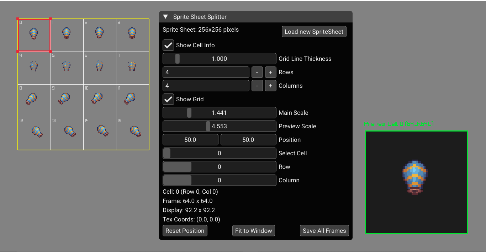

# 🎮 Sprite Sheet Cutter

A simple and intuitive tool to **view**, **cut**, and **export** individual frames from a sprite sheet.

---

## ✨ Features

- 🔍 **Preview Each Frame**: Select and view individual cells with zoom and position control.  
- 🔲 **Grid-Based Slicing**: Define the number of rows and columns to split any sprite sheet.  
- 💾 **Export Frames**: Save all frames individually to your desired location.  
- 📏 **Live Feedback**: View texture coordinates, frame dimensions, and pixel previews in real time.  

---

### Running the Project

1. **Open the Folder**  
   - In Visual Studio, select **File ▶ Open ▶ Folder…** and choose your project directory.

2. **Build**  
   - Visual Studio will detect the bundled `CMakeLists.txt` and configure the project automatically.  
   - Hit **Build ▶ Build All** (or press **Ctrl+Shift+B**).

3. **Launch**  
   - After a successful build, run the executable from Visual Studio (**Debug ▶ Start Debugging** or **Ctrl+F5**).

---

## 🎮 Usage

1. **Load a Sprite Sheet**  
   - Click **Load new SpriteSheet** and select your image (PNG, JPG, etc.).

2. **Configure the Grid**  
   - Adjust **Rows** and **Columns** to set how the sheet will be sliced.  
   - Toggle **Show Grid** to visualize cell boundaries.

3. **Select & Preview**  
   - Click on any cell in the grid or enter a cell index/row/column in the **Select Cell** fields.  
   - The right-hand **Preview Window** will display a zoomed view of the selected frame.

4. **Export Frames**  
   - Click **Save All Frames**.  
   - Choose an output folder in the file dialog—each cell will be saved as a separate PNG.

---

## 📑 Controls Reference

| UI Element               | Description                                         |
|--------------------------|-----------------------------------------------------|
| **Load new SpriteSheet** | Opens a dialog to choose a sprite sheet image.      |
| **Rows / Columns**       | Number of slices vertically and horizontally.       |
| **Show Grid**            | Toggles the overlay grid on the main canvas.        |
| **Select Cell**          | Enter cell index, row, or column to jump to a cell. |
| **Main / Preview Scale** | Zoom sliders for the main canvas and preview pane.  |
| **Reset Position**       | Re-center the main canvas view.                     |
| **Save All Frames**      | Export every cell as an individual PNG file.        |
---
